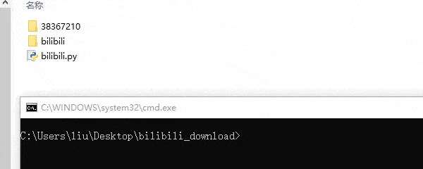

# bilibili

Extract the video on the bilibili cache on the phone.

将B站（[bilibili.com](bilibili.com)）缓存在手机上的视频提取出来。

## usage

B站在手机中的默认缓存路径为`Android/Data/tv.danmaku.bili/download/`，进去后可以看到av号，里面是对应的视频。

将视频拷到电脑里面，运行

```python
python bilibili.py avpath
```

## demo

